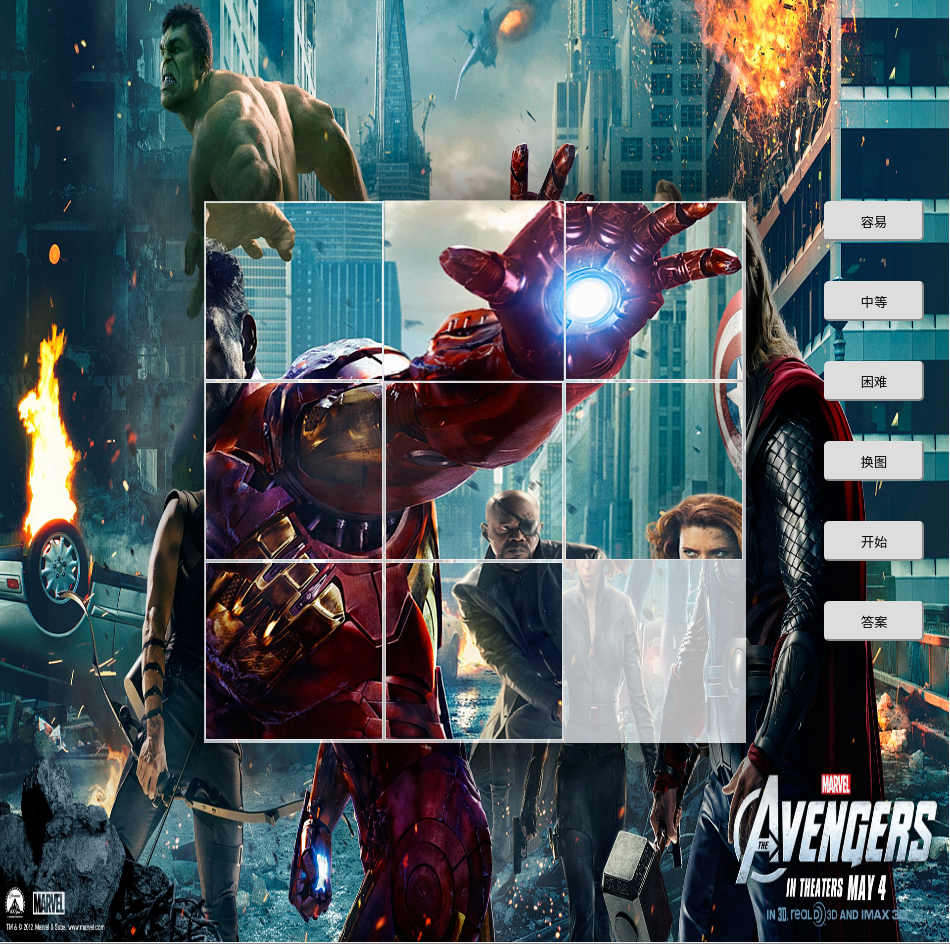
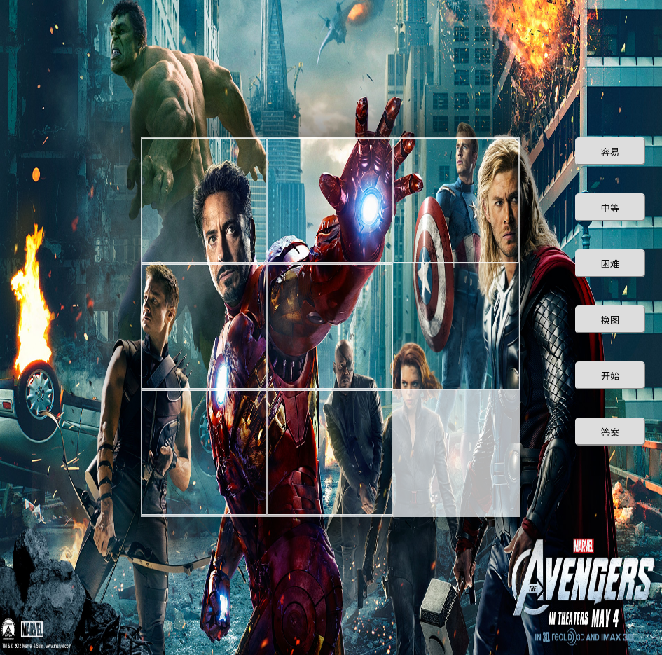
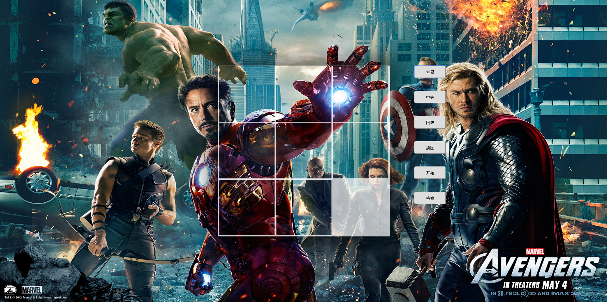
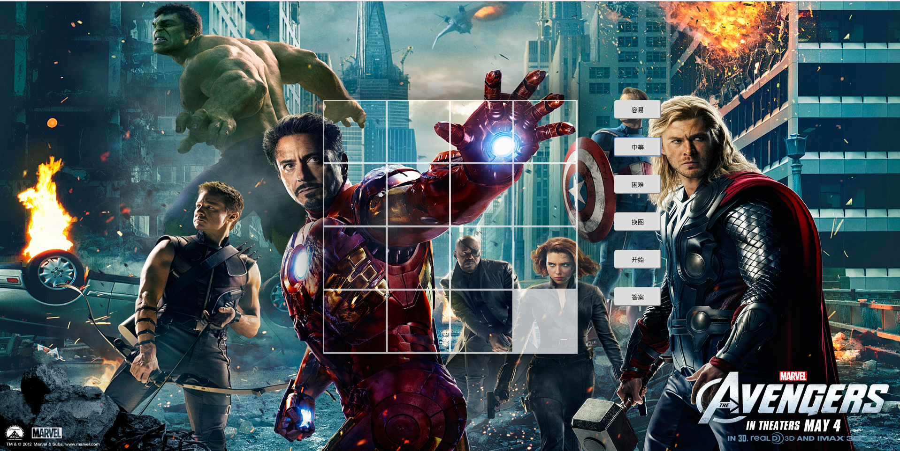
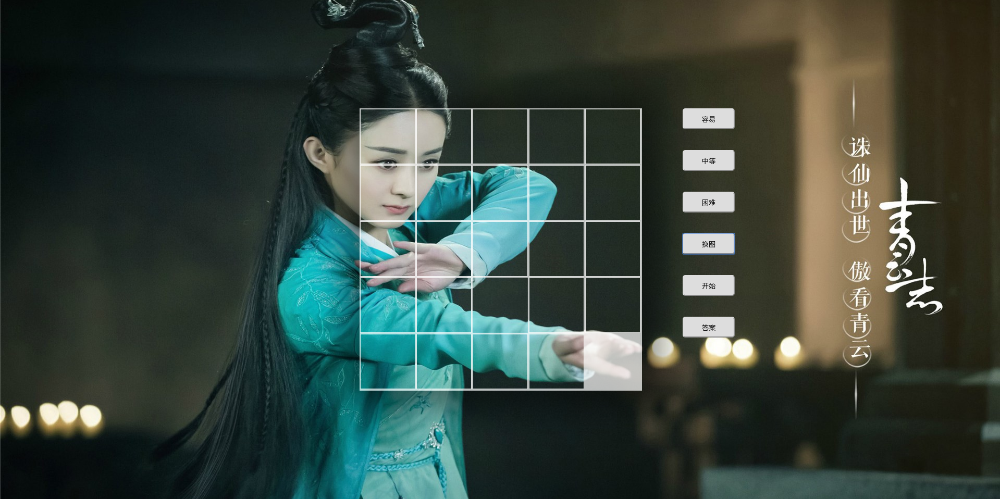

# 基于Jquery实现的拼图小游戏
### 介绍
1. 说明：这是一个基于jquery实现的小拼图游戏
2. 功能：具备困难等级设定、重置、图片背景更换等功能。“答案功能”尚未实现

### 技术实现
1. 最难的部分，就是难度选择部分，根据选择难度的不同，碎片化图片的数量也会不同。我这里的难度分三个等级：容易（9块）、中等（16块）、困难（25块）。这里需要考虑到的是在不同等级中，图块的`left`和`right`值是会不一样的，这是根据不同的情况分别动态计算出的。同时，也要使用一个数组来存放当前所有块的位置。下面大致说说我的做法：
	* 1) 首先，在不同等级中，图块的大小肯定是不一样的，所有我分别写了三个类对应三种不同的大小
	* 2) 其次，对于位置的计算，我则是实现了一个函数来动态计算不同难度下各个图块它们自己应该所处的位置，即它们的`left`和`right`属性值，且根据不同的情况，引入1）中定义好的相应的类。实现该逻辑的函数即为`behave.js`中的`changeMap()`函数
	* 3) 我是用`positions`这个数组用于存放当前各个图块所处的位置，例如：`position[i]=j`，则表示第 `i` 块拼图现在所处的位置是 `j`（注：每块拼图都有一个唯一的标识，每个位置也都有一个唯一的标识，当拼图自己的标识和其当前所处位置的标识一致时，则说明该图块处于正确的位置上）
2. 在调试过程中，发现当浏览器大小发送改变时，图块中的图片大小不会发生变化，这就出现了如下问题：
 
发现了没，图块和背景不一致了。后来我打算为最外层的`div`注册一个`resize`事件监听器，但发现div本身不具备这个事件，于是上网找了个插件，即为`other,js`，为`div`创建`resize`事件。在引入这个插件后，我为其`div`的`resize`事件注册事件监听器，它是用于重新绘制图块的，同时也用一个`GPS`数组用于存放绘制前各个图块所处的当前位置，以便能使得重绘后的各图块的位置与重绘前的一致，于是效果如下：
 

### 效果图
1. 容易：
 
2. 中等：
 
3. 困难：
 
4. 图片更换：
 